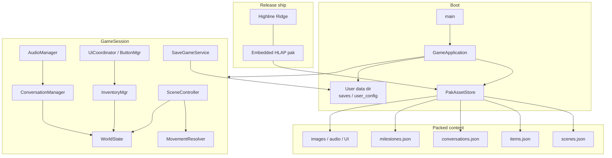

# Highline Ridge

**Highline Ridge** is a point-and-click mystery game built on the **Timberline** engine.

Storyboarding is still in progress; development focus is currently on Timberline as a reusable fixed-image narrative platform. A finished short game will showcase the engine. Contributions are welcome.

---

## The game

The year is roughly **1891**. You wake in a cave, injured and with total memory loss, high in the mountains of Appalachia — a couple thousand feet above a small mountain town known as **Highline Ridge**. As you move around town and talk to people, you get the sense that some of them know you — but they are not giving straight answers.

### Play loop

- Explore **fixed-image scenes** with directional movement (and exits that may be locked, dark, or gated by inventory / story flags)
- **Examine**, **take**, **use**, and **speak** through the action panel
- Manage **inventory** (weight limits, craft/combine, light sources for dark areas)
- Track **player stats** that change through play:
  - **Health** — at 0%, you die; increases with sleep
  - **Energy** — stamina for hard work; increases with sleep
  - **Resolve** — grit for demanding tasks; stimulants or booze can help
  - **Lucidity** — grip on reality; sleep helps; matters for conversation and intellect
  - **Charisma** — improves odds in conversation
- Progress via **milestones**, story flags, and conversation phases
- **Save / load** under the platform user-data directory (not next to the release binary)

### Release play (no `resources/` folder)

A normal **release** build embeds game content in the executable. You only need `Highline Ridge` (and optionally a sidecar `highline_assets.pak` fallback). Saves and settings live in:

| Platform | Directory |
|----------|-----------|
| Linux | `~/.highline_ridge/` |
| macOS | `~/Library/Application Support/Highline Ridge/` |
| Windows | `%AppData%\Highline Ridge\` |

Override with `HIGHLINE_DATA_DIR`.

```bash
./build-release.sh
cd build-release
./Highline\ Ridge
```

See [BUILD.md](BUILD.md) for platform packages, install prefixes, and optional editor / dev-tool flags.

---

## Timberline engine

Timberline is a rich storytelling engine that uses old-school fixed images so a small team (or one developer, with AI-assisted art) can ship scene-driven adventures without a full 3D pipeline.

### Capabilities

- **Fixed-image scenes** with JSON configuration for exits, movement, sub-scenes, overlays, and interactions
- **Conversation system** with phases, nested dialog choices, milestones, and requirements
- **TTS** via Grok/xAI voices: default voice per line, markup to switch narrator and actor voices mid-line (`{{voice:eve}}…{{/voice}}`), SHA-based regeneration so unchanged dialog is skipped
- **Data-driven resources** under `resources/` (images, audio, conversations, scenes, items, milestones); binaries may be xz-compressed
- **AssetStore** — disk loads in development; **embedded HLAP pak** in release (`HIGHLINE_RELEASE` / `HIGHLINE_EMBED_RESOURCES`)
- **Timberline Resource Editor** (`tools/scene-editor`) for scene maps, variables, inventories, effects, and conversation editing (optional in release)
- **Player stats**, inventory craft, and illumination rules for dark exits

### Architecture (release)

Release builds pack `resources/` into an embedded **HLAP** pak at configure/build time. At runtime, `GameApplication` mounts that pak, loads databases, then runs `GameSession`. Writable data (saves, `user_config.json`) never lives in the pak.



Authoring still edits loose files under `resources/`. The pack step (`tools/pack_assets.py`) runs automatically when embedding is ON. Dev builds keep disk `resources/` and typically build the scene editor by default.

### Resource editor architecture

```
main.cpp
   └─ SceneEditorApp          (shell: wire, fonts, selection, update/draw)
         ├─ DocumentWorkspace   (scenes/conversations JSON, tabs, dirty)
         ├─ EditorLayout        (panes / dividers)
         ├─ ThumbnailCache
         ├─ VariableEditor      (modal + TTS + text metrics)
         ├─ ConversationTree    (tree model + view)
         ├─ SceneGraphModel     (exits, levels, auto-layout, stack state)
         └─ SceneMapCanvas      (list/map/chrome draw + interaction)
```

### TTS (text to speech)

Audio is enabled for some dialogs. Voices must be generated if you want TTS playback; see `--help` on the game binary. As a general overview you will need to go to the [xAI console](https://console.x.ai). You will need to purchase credits to generate TTS. The cost should be minimal to regenerate voices.  Note that release builds do not store a resources folder and rather create binary blobs (pak files) to hold resources.  Once build you can not regenerate voices.  Once voices have been generated via a DEV build a clean build-release will package those voices in the release.

**Inline tags** (Grok TTS realism tags; Timberline also uses brace tags to switch voices mid-line):

| Tag | Purpose |
|-----|---------|
| `[pause]` | Standard pause for natural conversation breaks |
| `[pause:Xms]` | Precise pause, e.g. `[pause:500ms]` |
| `[long-pause]` | Longer break for dramatic timing |
| `[laugh]` / `[chuckle]` / `[giggle]` | Laughter |
| `[sigh]` / `[cry]` | Emotion |
| `[hum-tune]` | Humming |
| `[tsk]` / `[tongue-click]` / `[lip-smack]` | Mouth sounds |
| `[breath]` / `[inhale]` / `[exhale]` | Breath |

**Style and tone wrappings** — e.g. `<whisper>text</whisper>`:

`<soft>` `<whisper>` `<loud>` `<build-intensity>` `<decrease-intensity>` `<higher-pitch>` `<lower-pitch>` `<slow>` `<fast>` `<sing-song>` `<singing>` `<emphasis>`

**Voice substitution** — e.g. `{{voice:eve}}Hello,[pause] I am Eve{{/voice}}`

Timberline is designed to incorporate Grok TTS voices. Currently valid voices include: **ara**, **eve**, **helios**, **leo**, **rex**, **rigel**, **sal**.


---

## Developer commands

### CLI (`./Highline Ridge --help`)

| Command | Purpose |
|---------|---------|
| `-h`, `--help` | Show help |
| `--key=API_KEY` | xAI API key for TTS refresh (not stored) |
| `--refresh-voices` | Regenerate bundled TTS for all `ttsEnabled` owners; requires `--key` |
| `--refresh=ID` | Same, limited to one conversation / scene / item / recipe id |
| `-force`, `--force` | With refresh, ignore text hashes and regenerate matching lines |

Normal play uses already-bundled voice files under `resources/audio/tts/` and does **not** call xAI.
Release builds data files are immutable and therefore these commands are not available.

Examples:

```bash
./Highline\ Ridge --key=YOUR_XAI_API_KEY --refresh-voices
./Highline\ Ridge --key=YOUR_XAI_API_KEY --refresh=saloon_interior
./Highline\ Ridge --key=YOUR_XAI_API_KEY --force --refresh=blackjack_invite
```

### In-game developer tools

Compiled when **`HIGHLINE_DEV_TOOLS=ON`** (default for normal/dev builds; **OFF** for release unless you opt in).

```bash
./build-release.sh --with-dev-tools   # release binary that keeps tools
# or: cmake .. -DHIGHLINE_DEV_TOOLS=ON
```

| Input | Action |
|-------|--------|
| **Ctrl+Shift+S** | Toggle scene debug overlay (day, scene id, image, alt-image controls) |
| **\`** / **~** | Toggle developer command console |
| `give-item <item id>` | Add an item to inventory (raises quantity if stackable; skips non-stackable duplicates) |

In the console, type `give-item` and filter the item list; **↑/↓**, mouse wheel, or click to select; **Enter** / **Tab** auto-populates; **Enter** again executes. **Esc** closes the console.

### Release build script

```bash
./build-release.sh                      # embed ON, editor OFF, dev tools OFF
./build-release.sh --with-scene-editor  # also build ./scene-editor
./build-release.sh --with-dev-tools     # HIGHLINE_DEV_TOOLS=ON
./build-release.sh --help
```

---

## Build instructions

The main third-party dependency is **raylib** (fetched by CMake). You also need **liblzma**, **libjpeg**, and **libopusfile** / **libopus**. Builds have been tested on macOS. Full platform notes: **[BUILD.md](BUILD.md)**.

### Dev (disk resources + editor)

```bash
mkdir -p build && cd build
cmake ..
make -j$(sysctl -n hw.ncpu 2>/dev/null || nproc)
./Highline\ Ridge
./scene-editor
```

### Release (embedded resources)

```bash
./build-release.sh
cd build-release
./Highline\ Ridge
```

Building the scene editor is optional for play. Audio dialogs use bundled TTS when present; regenerate voices with the CLI above when you change dialog text.
