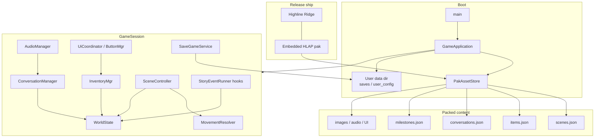
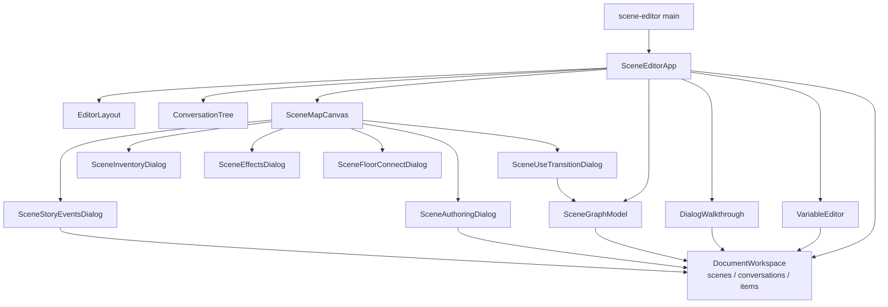
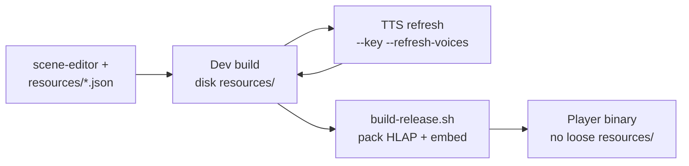

# Highline Ridge & Timberline

**Highline Ridge** is a late-19th-century point-and-click mystery. It ships as the showcase title for **Timberline**, a fixed-image narrative engine built for data-driven scenes, dialog, inventory, and xAI-backed TTS.

Storyboarding is still in progress. Engineering focus is Timberline as a reusable platform; a finished short game will demonstrate it.

---

## Abstract

**Timberline** is a C++/Raylib storytelling engine for *old-school fixed images*: rooms are authored as images + JSON (exits, flags, interactions, takeables, story events), not as a 3D world. A small team—or one human with AI-assisted art and dialog—can ship scene-driven adventures without a full production pipeline.

**Highline Ridge** is the bundled game: Appalachia, ~1891. You wake injured and amnesiac above a mountain town. People seem to know you. They are not giving straight answers. You explore, examine, take, use, speak, craft, and follow story flags and milestones while managing body and mind stats.

| Piece | Role |
|-------|------|
| **Timberline** | Engine: scenes, conversations, inventory, stats, audio/TTS, saves, resource editor |
| **Highline Ridge** | Showcase mystery content under `resources/` |
| **scene-editor** | Map, Variables, Conversations, Items, Use wires, story events |

---

## AI co-developed

This project is **mostly AI-developed** in partnership with a human director.

- **Human:** Dan Feerst (`feerstd@gmail.com`) — design direction, playtesting, art/TTS approvals, release decisions  
- **Agent:** **c0d3B0t555** — implementation, tooling, docs, issue triage, and iterative authoring alongside Dan  

Timberline is designed to work with **[xAI](https://x.ai)** / **Grok**:

- Dialog and scene TTS via Grok voices (`ara`, `eve`, `helios`, `leo`, `rex`, `rigel`, `sal`)
- Inline voice markup and realism tags (see [docs/tts.md](docs/tts.md))
- Refresh workflows that call the xAI API from **dev** builds (`--key`, `--refresh-voices`)

Art, narrative beats, and engine features are co-evolved in the loop: human taste + agent throughput.

---

## Contributing

Human and AI contributions are welcome — especially **Windows** support, storyboarding, scene/TTS generation, UI, and docs.

See **[CONTRIBUTING.md](CONTRIBUTING.md)** for contact (`feerstd@gmail.com`), branch/PR rules, and the current needs list. Work from the latest release-candidate branch (currently `v0.3.0.0_RC`).

---

## Game stats and mechanics

### Play loop

- Explore **fixed-image scenes** with compass exits (and gates: inventory, flags, darkness)
- **Examine**, **Take**, **Use**, **Speak** from the action panel
- Manage **inventory** (weight, craft/combine, light sources)
- Advance via **milestones**, **story flags**, **conversations**, and **story events** (enter/exit/examine beats)

### Player stats

| Stat | Meaning |
|------|---------|
| **Health** | At 0%, you die. Sleep restores it. |
| **Energy** | Stamina for hard work. Sleep restores it. |
| **Resolve** | Grit for demanding tasks; stimulants/booze can help. |
| **Lucidity** | Grip on reality; sleep helps; gates conversation/intellect. At **0%**, the game transitions back to waking in the cave. |
| **Charisma** | Improves odds in conversation. |

Status effects can be one-shot or repeatable (`repeat` / `useRepeatStatus`). Scene **Effects** and interaction status deltas author these in the editor.

### Movement and Use

- **Compass exits** — gold mid-edge wires on the map  
- **Use → another scene** — silver corner wires (`useExit` or interaction `exitSceneId`)  
- **Same-room Use** (narrative only) — no map wire; still appears in-game  

Details: [docs/scene-map-exits.md](docs/scene-map-exits.md).

### Saves

Release builds do **not** write beside the binary:

| Platform | User data |
|----------|-----------|
| Linux | `~/.highline_ridge/` |
| macOS | `~/Library/Application Support/Highline Ridge/` |
| Windows | `%AppData%\Highline Ridge\` |

Override with `HIGHLINE_DATA_DIR`.

---

## Multi-platform build

**Dependencies:** CMake, C++17, Raylib (fetched), **liblzma**, **libjpeg**, **libopusfile** / **libopus**.

Full platform steps (macOS Homebrew/`/opt/homebrew`, Linux apt, Windows vcpkg): **[BUILD.md](BUILD.md)**.

### Dev (disk `resources/` + editor)

```bash
mkdir -p build && cd build
cmake ..
cmake --build . -j$(sysctl -n hw.ncpu 2>/dev/null || nproc)
./Highline\ Ridge
./scene-editor
```

### Release (embedded HLAP pak)

```bash
./build-release.sh
cd build-release
./Highline\ Ridge
```

| Mode | Embed | Scene editor | Dev tools / TTS refresh CLI |
|------|-------|--------------|------------------------------|
| Dev (default) | OFF | ON | ON |
| `./build-release.sh` | ON | OFF | OFF |
| + `--with-scene-editor` | ON | ON | OFF |
| + `--with-dev-tools` | ON | — | ON |

---

## Development

### Scene editor tutorial

See **[docs/scene-editor-tutorial.md](docs/scene-editor-tutorial.md)** — map, Variables, Conversations, Use wires, Events, Inventory/Effects, and screenshot placeholders under `docs/images/`.

### TTS syntax and usage

See **[docs/tts.md](docs/tts.md)** — voices, `[pause]` / style tags, `{{voice:…}}`, refresh CLI, and release packaging.

Dialog **world tokens** like `{tab_amount}` (not TTS): [docs/dialog-tokens.md](docs/dialog-tokens.md).

### Dev vs release package

See **[docs/dev-vs-release.md](docs/dev-vs-release.md)** — what players get vs what authors need.

### Architecture diagrams

#### Game (release)



#### Scene editor



#### Content → runtime (authoring loop)



### In-game developer tools

When `HIGHLINE_DEV_TOOLS=ON` (dev default):

| Input | Action |
|-------|--------|
| **Ctrl+Shift+S** | Scene debug overlay |
| **\`** / **~** | Developer console (`give-item`, …) |

### Related docs

| Doc | Topic |
|-----|-------|
| [BUILD.md](BUILD.md) | Platform builds, flags, Homebrew `/opt/homebrew` |
| [docs/scene-editor-tutorial.md](docs/scene-editor-tutorial.md) | Editor walkthrough |
| [docs/tts.md](docs/tts.md) | TTS markup and refresh |
| [docs/dev-vs-release.md](docs/dev-vs-release.md) | Dev vs player package |
| [docs/scene-map-exits.md](docs/scene-map-exits.md) | Compass vs Use wires |
| [docs/dialog-tokens.md](docs/dialog-tokens.md) | `{tab_amount}`-style tokens |
| [docs/display-aspect.md](docs/display-aspect.md) | Display aspect preferences |
| [docs/platform-parallelism.md](docs/platform-parallelism.md) | JobSystem / parallelism notes |

---

## License

See [LICENSE](LICENSE).
