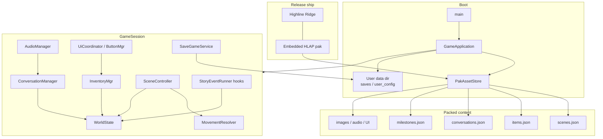
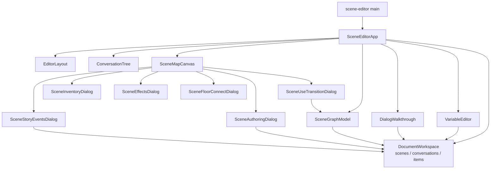
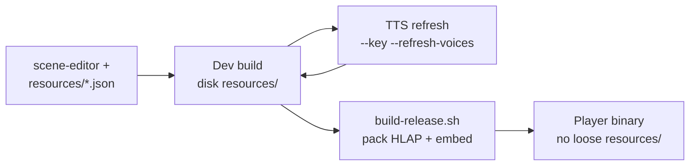

# Highline Ridge & Timberline

**Highline Ridge** is a late-19th-century point-and-click mystery. It ships as the showcase title for **Timberline**, a fixed-image narrative engine built for data-driven scenes, dialog, inventory, and xAI-backed TTS.

Storyboarding is still in progress. Engineering focus is Timberline as a reusable platform; a finished short game will demonstrate it.

---

## Abstract

**Timberline** is a C++/Raylib storytelling engine for *old-school fixed images*: rooms are authored as images + JSON (exits, flags, interactions, takeables, story events), not as a 3D world. A small team—or one human with AI-assisted art and dialog—can ship scene-driven adventures without a full production pipeline.

**Highline Ridge** is the bundled game: Appalachia, ~1891. You wake injured and amnesiac above a mountain town. People seem to know you. They are not giving straight answers. You explore, examine, take, use, speak, craft, and follow story flags and milestones while managing body and mind stats.

| Piece | Role |
|-------|------|
| **Timberline** | Engine: scenes, conversations, inventory, stats, audio/TTS, saves, resource editor |
| **Highline Ridge** | Showcase mystery content under `resources/` |
| **scene-editor** | Map, Variables, Conversations, Items, Use wires, story events |

---

## Documentation

**Index:** **[`docs/README.md`](docs/README.md)** — full catalog of topic guides, plus which page owns keys / audio / TTS / exits so we do not repeat the same how-to in multiple places.

| Quick links | |
|-------------|--|
| Build / platforms / save paths | [BUILD.md](BUILD.md) |
| Contributing | [CONTRIBUTING.md](CONTRIBUTING.md) |
| Scene editor | [docs/scene-editor-tutorial.md](docs/scene-editor-tutorial.md) |
| API keys | [docs/api-keys.md](docs/api-keys.md) |

---

## AI co-developed

This project is **mostly AI-developed** in partnership with a human director.

- **Human:** Dan Feerst (`feerstd@gmail.com`) — design direction, playtesting, art/TTS approvals, release decisions  
- **Agent:** **c0d3B0t555** — implementation, tooling, docs, issue triage, and iterative authoring alongside Dan  

Timberline integrates **[xAI](https://x.ai)** / **Grok** (TTS, images) and **ElevenLabs** (ambient, music, SFX). Voice markup: [docs/tts.md](docs/tts.md). Keys and which Generate actions need which provider: [docs/api-keys.md](docs/api-keys.md).

Art, narrative beats, and engine features are co-evolved in the loop: human taste + agent throughput.

---

## Contributing

Human and AI contributions are welcome — especially **Windows** support, storyboarding, scene/TTS generation, UI, and docs. See **[CONTRIBUTING.md](CONTRIBUTING.md)** (contact, branch/PR rules, needs list). Work from the latest release-candidate branch (currently `v0.3.0.0_RC`).

---

## Game stats and mechanics

### Play loop

- Explore **fixed-image scenes** with compass exits (and gates: inventory, flags, darkness)
- **Examine**, **Take**, **Use**, **Speak** from the action panel
- Manage **inventory** (weight, craft/combine, light sources)
- Advance via **milestones**, **story flags**, **conversations**, and **story events** (enter/exit/examine beats)

### Player stats

| Stat | Meaning |
|------|---------|
| **Health** | At 0%, you die. Sleep restores it. |
| **Energy** | Stamina for hard work. Sleep restores it. |
| **Resolve** | Grit for demanding tasks; stimulants/booze can help. |
| **Lucidity** | Grip on reality; sleep helps; gates conversation/intellect. At **0%**, the game transitions back to waking in the cave. |
| **Charisma** | Improves odds in conversation. |

Status effects can be one-shot or repeatable (`repeat` / `useRepeatStatus`). Scene **Effects** and interaction status deltas author these in the editor.

### Movement and Use

Compass (gold), floors (stair badges), Use (silver), and gated MOVE are authored on the scene map. Full detail: [docs/scene-map-exits.md](docs/scene-map-exits.md).

### Saves

Release builds store saves/settings in the platform **user data** directory (not beside the binary). Paths and `HIGHLINE_DATA_DIR`: [BUILD.md](BUILD.md#user-data-saves--settings).

---

## Multi-platform build

**Dependencies:** CMake, C++17, Raylib (fetched), **liblzma**, **libjpeg**, **libopusfile** / **libopus**. Platform steps and flags: **[BUILD.md](BUILD.md)**. Dev vs player package: [docs/dev-vs-release.md](docs/dev-vs-release.md).

### Dev (disk `resources/` + editor)

```bash
mkdir -p build && cd build
cmake ..
cmake --build . -j$(sysctl -n hw.ncpu 2>/dev/null || nproc)
./Highline\ Ridge
./scene-editor
```

### Release (embedded HLAP pak)

```bash
./build-release.sh
cd build-release
./Highline\ Ridge
```

---

## Development

### Architecture diagrams

#### Game (release)


```mermaid
flowchart TB
  subgraph Ship["Release ship"]
    BIN["Highline Ridge"]
    PAK["Embedded HLAP pak"]
  end

  subgraph Boot["Boot"]
    MAIN["main"]
    APP["GameApplication"]
    STORE["PakAssetStore"]
    UDATA["User data dir\nsaves / user_config"]
  end

  subgraph Data["Packed content"]
    SC["scenes.json"]
    IT["items.json"]
    CV["conversations.json"]
    MS["milestones.json"]
    MED["images / audio / UI"]
  end

  subgraph Session["GameSession"]
    SCCTL["SceneController"]
    MOVE["MovementResolver"]
    INV["InventoryMgr"]
    AUD["AudioManager"]
    UI["UiCoordinator / ButtonMgr"]
    CONV["ConversationManager"]
    EV["StoryEventRunner hooks"]
    SAVE["SaveGameService"]
    WS["WorldState"]
  end

  MAIN --> APP
  BIN --- PAK
  APP --> STORE
  PAK --> STORE
  APP --> UDATA
  STORE --> SC & IT & CV & MS & MED
  APP --> Session
  SCCTL --> MOVE
  SCCTL --> WS
  EV --> WS
  CONV --> WS
  INV --> WS
  SAVE --> UDATA
  UI --> INV
  AUD --> CONV
```

#### Scene editor


```mermaid
flowchart TB
  MAIN["scene-editor main"] --> APP["SceneEditorApp"]
  APP --> DOCS["DocumentWorkspace\nscenes / conversations / items"]
  APP --> LAY["EditorLayout"]
  APP --> VAR["VariableEditor"]
  APP --> CTREE["ConversationTree"]
  APP --> WALK["DialogWalkthrough"]
  APP --> GRAPH["SceneGraphModel"]
  APP --> MAP["SceneMapCanvas"]

  MAP --> AUTH["SceneAuthoringDialog"]
  MAP --> USE["SceneUseTransitionDialog"]
  MAP --> EV["SceneStoryEventsDialog"]
  MAP --> INV["SceneInventoryDialog"]
  MAP --> FX["SceneEffectsDialog"]
  MAP --> FLOOR["SceneFloorConnectDialog"]

  VAR --> DOCS
  WALK --> DOCS
  GRAPH --> DOCS
  AUTH --> DOCS
  USE --> GRAPH
  EV --> DOCS
```

#### Content → runtime (authoring loop)


```mermaid
flowchart LR
  ED["scene-editor +\nresources/*.json"] --> DEV["Dev build\ndisk resources/"]
  DEV --> TTS["TTS refresh\n--key --refresh-voices"]
  TTS --> DEV
  DEV --> REL["build-release.sh\npack HLAP + embed"]
  REL --> PLAY["Player binary\nno loose resources/"]
```

### In-game developer tools

When `HIGHLINE_DEV_TOOLS=ON` (dev default):

| Input | Action |
|-------|--------|
| **Ctrl+Shift+S** | Scene debug overlay |
| **\`** / **~** | Developer console (`give-item`, …) |

Full documentation catalog: [docs/README.md](docs/README.md).

---

## License

See [LICENSE](LICENSE).
